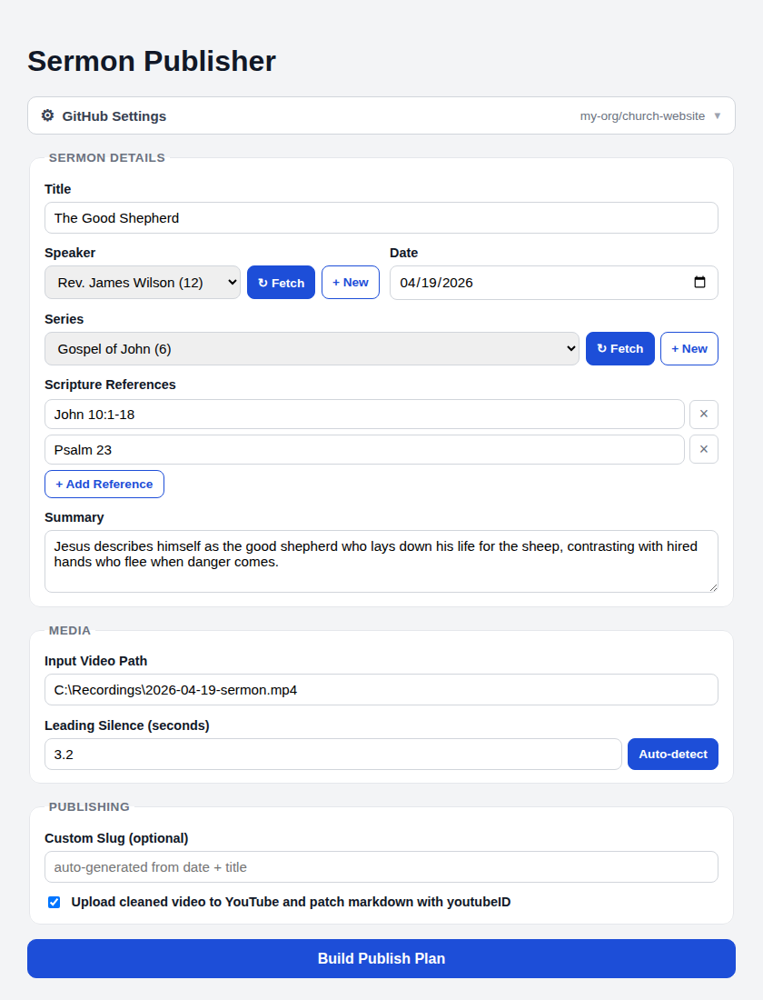
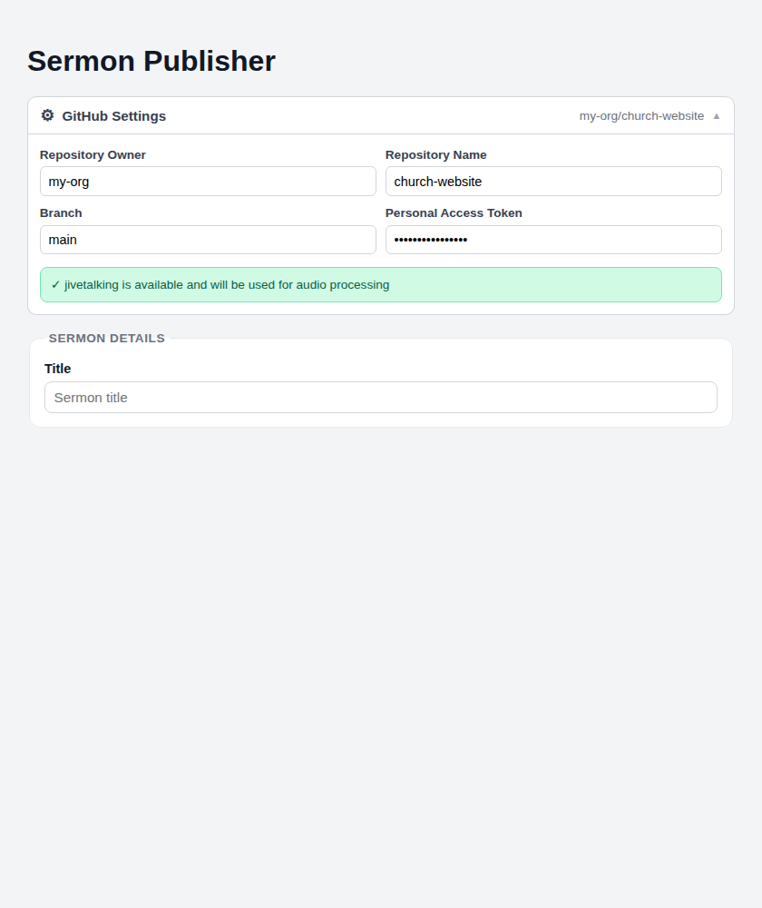

# Sermon Publisher

Desktop app to publish sermon media and content to a Hugo site (Cloudflare Pages) and optionally YouTube.

Built with **Tauri 2** (Rust backend) and **React + TypeScript + Vite** (frontend).





## Download

Grab the latest installer for your platform from the
[**Releases**](../../releases) page:

| Platform | Artifact |
|---|---|
| Windows (x64) | `.msi` or `.exe` installer |
| macOS (Apple Silicon) | `.dmg` |
| macOS (Intel) | `.dmg` |
| Linux (x64) | `.deb` or `.AppImage` |

> **macOS note:** You may need to right-click → Open the first time to bypass
> Gatekeeper.

### Bundled dependencies

The release installers include:

- **ffmpeg** — used for audio extraction, silence detection, and video
  processing. A platform-specific static build is bundled as a Tauri sidecar so
  you do not need to install ffmpeg separately.

## Features

- **Non-technical publish form** — fill in title, speaker, date, series,
  scripture references, and summary without touching any config files.
- **Publish plan generation** — validates metadata and produces a canonical slug,
  Hugo markdown, output paths, and a full pipeline step plan:
  1. Extract audio from source video
  2. Run Jivetalking on extracted audio
  3. Trim leading silence
  4. Create website audio file
  5. Generate thumbnail image
  6. Create cleaned YouTube video
  7. Generate sermon markdown
  8. Write files to GitHub via API
  9. *(optional)* Upload cleaned video to YouTube and patch markdown with
     `youtubeID`
- **GitHub integration** — the settings panel stores repository details (owner,
  repo, branch, PAT) in localStorage. A `list_series` command fetches the
  `content/sermons` directory from the configured repo, parses front-matter, and
  returns a deduplicated series list sorted by most-recent date.
- **Silence detection** — `detect_leading_silence` runs
  `ffmpeg -af silencedetect` against the source video and returns the end-time
  of the first silent region, letting the app auto-fill the leading-silence
  value.

## Getting Started

The sections below walk through setting up a development environment from
scratch on each supported platform.  If you only want to **use** the app,
download a pre-built installer from the [Releases](../../releases) page instead.

### Prerequisites (all platforms)

| Tool | Version | Purpose |
|------|---------|---------|
| [Node.js](https://nodejs.org/) | LTS (≥ 20) | Frontend build tooling |
| [Rust](https://www.rust-lang.org/tools/install) | stable | Tauri backend |
| npm | (ships with Node) | Package management |

You also need the **Tauri v2 system dependencies** for your OS — see the
[Tauri prerequisites guide](https://v2.tauri.app/start/prerequisites/) for a
full list.

---

### Windows (WSL setup included)

Sermon Publisher runs natively on Windows, but the **jivetalking** audio
normalisation tool is a Linux binary.  On Windows the app automatically
executes jivetalking through [WSL](https://learn.microsoft.com/en-us/windows/wsl/)
when it is available.

#### 1. Install WSL (if you don't have it)

Open **PowerShell as Administrator** and run:

```powershell
wsl --install
```

This installs WSL 2 with the default Ubuntu distribution.  Restart your
computer when prompted.  After rebooting, Ubuntu will open automatically to
finish setup — create a Unix username and password when asked.

> **Tip:** Confirm everything is working with `wsl --status` in a normal
> PowerShell window.

#### 2. Install Node.js

Download and run the **LTS** installer from <https://nodejs.org/>.
Alternatively, use [winget](https://learn.microsoft.com/en-us/windows/package-manager/winget/):

```powershell
winget install OpenJS.NodeJS.LTS
```

Verify:

```powershell
node --version
npm --version
```

#### 3. Install Rust

Open PowerShell and run:

```powershell
winget install Rustlang.Rustup
```

Or download [rustup-init.exe](https://www.rust-lang.org/tools/install) and run
it.  Accept the defaults.  After installation, open a **new** terminal and
verify:

```powershell
rustc --version
cargo --version
```

#### 4. Install Tauri / Windows system dependencies

Tauri on Windows requires the **Microsoft C++ Build Tools** and the
**WebView2** runtime.  Follow the
[Tauri Windows prerequisites](https://v2.tauri.app/start/prerequisites/#windows)
guide, or:

```powershell
# Install Visual Studio Build Tools (includes MSVC & Windows SDK)
winget install Microsoft.VisualStudio.2022.BuildTools --override "--wait --passive --add Microsoft.VisualStudio.Workload.VCTools --includeRecommended"
```

WebView2 is pre-installed on Windows 10 (1803+) and Windows 11.

#### 5. Clone, install & run

```powershell
git clone https://github.com/halcycon/SermonPublisher.git
cd SermonPublisher\desktop
npm install
npm run tauri dev
```

> **Note:** On first run Cargo will download and compile Rust dependencies.
> This can take several minutes.

#### 6. Build a release installer

```powershell
cd desktop
npm run tauri build
```

Installers (`.msi` / `.exe`) are written to
`desktop\src-tauri\target\release\bundle\`.

---

### macOS

#### 1. Install Xcode Command Line Tools

```bash
xcode-select --install
```

#### 2. Install Node.js

Use [Homebrew](https://brew.sh/):

```bash
brew install node
```

Or download the macOS LTS installer from <https://nodejs.org/>.

#### 3. Install Rust

```bash
curl --proto '=https' --tlsv1.2 -sSf https://sh.rustup.rs | sh
source "$HOME/.cargo/env"
```

#### 4. Clone, install & run

```bash
git clone https://github.com/halcycon/SermonPublisher.git
cd SermonPublisher/desktop
npm install
npm run tauri dev
```

#### 5. Build a release installer

```bash
cd desktop
npm run tauri build
```

The `.dmg` is written to `desktop/src-tauri/target/release/bundle/dmg/`.

---

### Linux (Debian / Ubuntu)

#### 1. Install system dependencies

```bash
sudo apt update
sudo apt install -y \
  libwebkit2gtk-4.1-dev \
  build-essential \
  curl \
  wget \
  file \
  libxdo-dev \
  libssl-dev \
  libayatana-appindicator3-dev \
  librsvg2-dev
```

#### 2. Install Node.js

```bash
curl -fsSL https://deb.nodesource.com/setup_lts.x | sudo -E bash -
sudo apt install -y nodejs
```

#### 3. Install Rust

```bash
curl --proto '=https' --tlsv1.2 -sSf https://sh.rustup.rs | sh
source "$HOME/.cargo/env"
```

#### 4. Clone, install & run

```bash
git clone https://github.com/halcycon/SermonPublisher.git
cd SermonPublisher/desktop
npm install
npm run tauri dev
```

#### 5. Build a release installer

```bash
cd desktop
npm run tauri build
```

Installers (`.deb` / `.AppImage`) are written to
`desktop/src-tauri/target/release/bundle/`.

---

## Development

### Useful commands

All commands are run from the `desktop/` directory:

```bash
# Start the app in development mode (hot-reload)
npm run tauri dev

# Build a production release
npm run tauri build

# Run only the Vite frontend dev server (no Tauri shell)
npm run dev

# Type-check the frontend
npx tsc --noEmit
```

### Sidecar binaries

The app bundles two sidecar binaries that the CI workflow downloads
automatically during a release build.  When developing locally the sidecars are
**not** required to launch the app, but features that depend on them (audio
extraction, silence detection, jivetalking normalisation) will fail unless the
binaries are present in `desktop/src-tauri/binaries/`.

| Binary | What it does | Where to get it |
|--------|-------------|-----------------|
| **ffmpeg** | Audio extraction, silence detection, video processing | <https://ffmpeg.org/download.html> — place a static build at `binaries/ffmpeg-<rust-target>` (e.g. `ffmpeg-x86_64-pc-windows-msvc.exe`) |
| **jivetalking** | Audio normalisation / loudness processing | <https://github.com/linuxmatters/jivetalking/releases> — place the binary at `binaries/jivetalking-<rust-target>` |

On Windows, jivetalking runs through WSL.  The release CI places the Linux
binary at `binaries/jivetalking-wsl` and a placeholder Windows sidecar at
`binaries/jivetalking-x86_64-pc-windows-msvc.exe`.

### Recommended IDE setup

- [VS Code](https://code.visualstudio.com/) with:
  - [Tauri](https://marketplace.visualstudio.com/items?itemName=tauri-apps.tauri-vscode)
  - [rust-analyzer](https://marketplace.visualstudio.com/items?itemName=rust-lang.rust-analyzer)

### Configuration at runtime

On first launch the app opens the **GitHub Settings** panel.  Fill in:

| Field | Description |
|-------|-------------|
| Repository Owner | GitHub user or organisation (e.g. `my-org`) |
| Repository Name | The Hugo site repository (e.g. `church-website`) |
| Branch | Target branch — defaults to `main` |
| Personal Access Token | A GitHub PAT with `repo` scope |

These values are stored in the browser's `localStorage` and persist across
sessions.  The app uses them to fetch series and speaker lists from the Hugo
content directory and to commit sermon files via the GitHub API.

## Creating a release

Releases are built automatically by the **Release** GitHub Actions workflow.

1. Tag a commit with a version tag:
   ```bash
   git tag v0.1.0
   git push origin v0.1.0
   ```
2. The workflow builds the Tauri app on Windows, macOS (Intel + Apple Silicon),
   and Linux, downloads a static ffmpeg for each platform, and uploads the
   installers to a **draft** GitHub release.
3. Review the draft release on the Releases page and publish it when ready.

You can also trigger the workflow manually from the **Actions** tab using
`workflow_dispatch`.

## Project layout

```
desktop/
├── src/             # React + TypeScript frontend
├── src-tauri/       # Rust backend (Tauri commands)
│   ├── binaries/    # Sidecar binaries (ffmpeg) — populated by CI
│   └── src/
│       ├── lib.rs   # Tauri commands & helpers
│       └── main.rs  # App entry point
├── package.json
└── vite.config.ts
```

## License

See [LICENSE](LICENSE).
